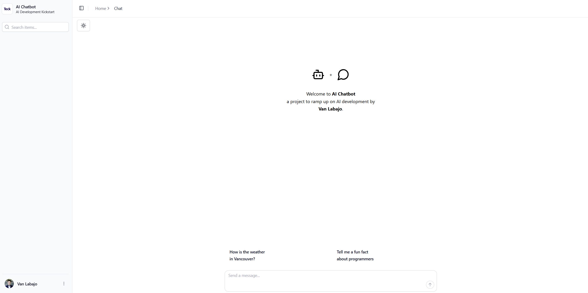

# ai-chatbot
An AI-powered chat assistant integrated with a .NET backend and a React frontend. The chatbot leverages Azure OpenAI for natural language processing and responds to user queries in real-time.

## Overview
The AI Chatbot is a modern conversational assistant powered by Azure OpenAI for natural language processing. It features a .NET backend and a React/Next.js frontend, offering real-time chat, and secure authentication. Designed for scalability, it is ideal for integrating conversational AI into applications or workflows.



## Getting Started

Follow these steps to set up and run the project:

### 1. Set Up Infrastructure with Terraform

1. **Navigate to the Terraform Directory**:
   ```bash
   cd Terraform
   ```
2. **Initialize Terraform**:
   ```bash
   terraform init
   ```
3. **Apply the Terraform Configuration**:
   ```bash
   terraform apply
   ```
   * Review the plan and type `yes` to confirm.
   * This will create the necessary Azure resources, including the Cognitive Services account and App Service.

---

### 2. Build and Start the Backend API

1. **Navigate to the Backend Directory**:
   ```bash
   cd backend.api
   ```
2. **Restore Dependencies**:
   ```bash
   dotnet restore
   ```
3. **Build the Project**:
   ```bash
   dotnet build
   ```
4. **Run the API**:
   ```bash
   dotnet run --launch-profile https
   ```
   * The API will start on [https://localhost:7256](https://localhost:7256/) (or another port if configured).
   * Swagger UI is available at [https://localhost:7256/swagger](https://localhost:7256/swagger).

---

### 3. Prepare and Start the Frontend

1. **Navigate to the Frontend Directory**:
   ```bash
   cd frontend.web
   ```
2. **Install Dependencies**:
   ```bash
   pnpm install
   ```
3. **Start the Development Server**:
   ```bash
   pnpm run dev
   ```
   * The frontend will start on [http://localhost:3000](http://localhost:3000) (or another port if configured).

4. **Access the Chatbot**:
   * Open your browser and navigate to the frontend URL (e.g., [http://localhost:3000](http://localhost:3000)).
   * Interact with the chatbot, which communicates with the backend API and Azure OpenAI for responses.

---

### Additional Notes
  * Ensure you have the following tools installed:
    - [Terraform](https://developer.hashicorp.com/terraform)
    - [.NET SDK](https://dotnet.microsoft.com/en-us/download)
    - [pnpm](https://pnpm.io/installation)
    - [Node.js](https://nodejs.org) (specifically v24)
  * Azure resources created by Terraform may incur costs. Remember to destroy the resources when no longer needed:
    ```bash
    terraform destroy
    ```
  * The Frontend project:
    - This project is modified from the [Tremor Dashboard](https://tremor.so) template and is licensed under the [Tremor License](https://blocks.tremor.so/license).
    - The chat interface is modified from [chatbot-ui](https://github.com/ChristophHandschuh/chatbot-ui).
    - [`next/font`](https://nextjs.org/docs/basic-features/font-optimization) is used to automatically optimize and load Inter, a custom Google Font.
    - [`Tremor Raw`](https://raw.tremor.so/docs/getting-started/installation) components are used for the UI.
    - For a deeper understanding of the technologies used in this project, refer to:
      - [Tremor Raw](https://raw.tremor.so) - Tremor Raw documentation.
      - [Tailwind CSS](https://tailwindcss.com) - A utility-first CSS framework.
      - [Next.js](https://nextjs.org/docs) - Next.js documentation.
      - [Radix UI](https://www.radix-ui.com) - Radix UI Website.
      - [Recharts](https://recharts.org) - Recharts documentation and website.
      - [TanStack Table](https://tanstack.com/table/latest) - TanStack table documentation.
